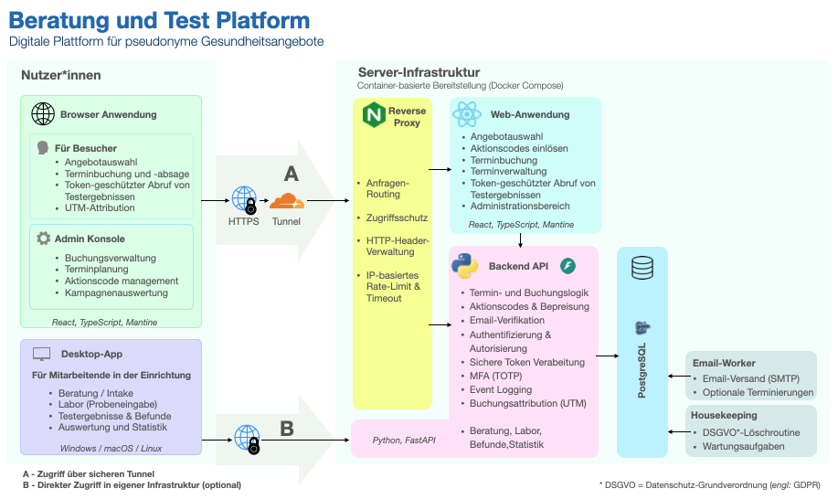
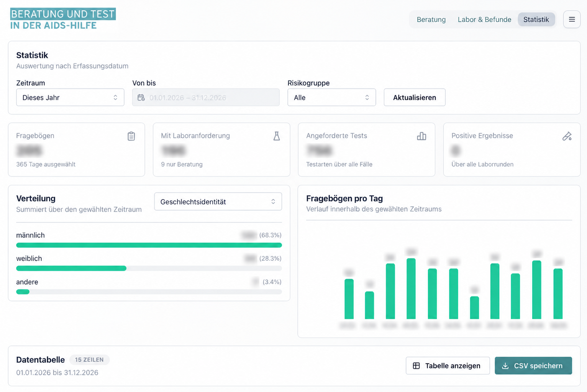

# Beratung und Test Plattform

Digitale Plattform für pseudonyme Gesundheitsangebote.

## Überblick

Eine integrierte Plattform zur Verwaltung pseudonymer Gesundheitsangebote, die derzeit für die HIV/STI-Prävention und -Diagnostik konzipiert ist.

Web- und Desktop-Anwendungen greifen auf ein gemeinsames Backend zu und bilden einen durchgängigen digitalen Ablauf von der Ansprache und Terminbuchung über Beratung und Diagnostik bis zur Ergebnismitteilung.

  
  

## Die Plattform

Die Plattform bildet den gesamten Ablauf eines Gesundheitsangebots ab:

1. Online-Terminbuchung und Terminmanagement
2. Beratung und Probenentnahme
3. Management und Freigabe von Laborergebnissen
4. Sichere Online-Ergebnismitteilung
5. Evaluation und Statistik

## Komponenten

### Web-Anwendung
Terminbuchung, Terminverwaltung, E-Mail-Kommunikation,
Online-Ergebnismitteilung

### Desktop-App
Beratung, Fragebogenerfassung, Labor, Befunde, Statistik

### Gemeinsames Backend
API, Datenmodel, Autorisierung, Pseudonymisierung,
Workflow-Logik

## Architektur

  

## Technologien

**Frontend:** React · TypeScript · Mantine · Tauri 

**Backend:** FastAPI · Python · PostgreSQL

**Deployment:** Docker · nginx · Cloudflare Tunnel · GitHub Actions & Container Registry

## Reichweitenmessung in Zielgruppen

Bei der Online-Terminbuchung werden UTM-Parameter erfasst und der gebuchten Leistung zugeordnet. Dadurch wird messbar, wie stark ein Angebot in Anspruch genommen wird und welche Zielgruppen durch unterschiedliche Kampagnen und Zugangswege erreicht werden. Auch Angaben aus der Beratung und diagnostische Ergebnisse können in aggregierte Analysen einbezogen werden.

Die Plattform schafft damit eine Datengrundlage zur Evaluation von Kampagnen und Gesundheitsangeboten, ohne individuelle Nutzerprofile zu erstellen.

## Datenschutz und Pseudonymisierung

Bei der Terminvergabe wird eine zufällig erzeugte mnemonische Kennung erstellt (z.B. `STILLER-GARTEN`). Sie ist leicht merkbar und begleitet den pseudonymen Ablauf von der Terminbuchung über Beratung und Diagnostik bis zur Ergebnismitteilung. Dadurch kann der Vorgang über die verschiedenen Komponenten der Plattform hinweg zugeordnet werden, ohne dass hierfür eine dauerhafte personenbezogene Kennung erforderlich ist.

Terminverwaltung und Ergebnismitteilung sind unabhängig von der E-Mail-Adresse über persönliche, kryptografisch zufällige URLs mit hoher Entropie möglich. Für den Zugriff auf online bereitgestellte Laborergebnisse wird zusätzlich ein persönlicher Zugangscode verwendet.

Der administrative Zugang zur Web-Anwendung ist durch Multi-Faktor-Authentifizierung mit Passwort und zeitbasiertem Einmalpasswort (TOTP) geschützt.

Die Desktop-App verwendet eine rollenbasierte Authentifizierung und Autorisierung. Zugriffsrechte werden über Bearer-Token durch das gemeinsame Backend kontrolliert.

## Screenshots

  
  

  <!--  -->
  
  

  
  

  
   

→ [Weitere Screenshots](screenshots/readme.md)

## Hinweis

Dieses Repository dient der Dokumentation und Präsentation
des Projekts. Der Quellcode wird nicht öffentlich bereitgestellt.
